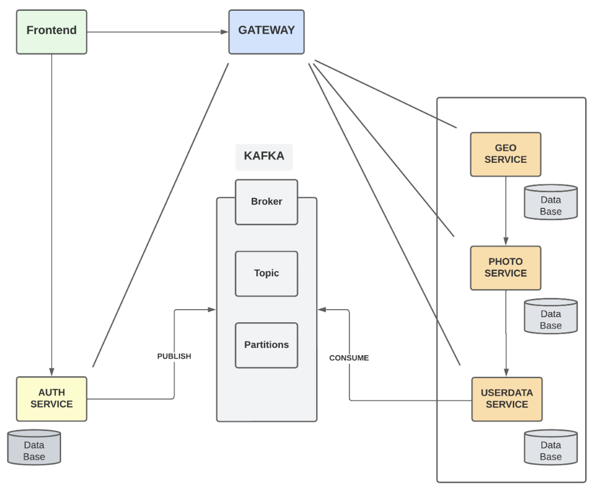

# Rangiffler
Микросервисный web сайт посвященный путешествиям. С возможностью добавления друзей
и публикаций фото которые будут доступны друзьям для просмотра и лайков.

- Эксперимента ради применён для заготовки данных **GraphQl**, в реальном продакшн проекте предпочел бы **gRPC** либо **SQL** запросы в зависимости от обстоятельств, в целом проект для меня был экспериментальным. 
- Цель - попытаться не стандартно покрыть тестами. В процессе написания предпочтение отдавал технологиям с которыми меньше всего опыта в работе.
    
Например: 
 - мало опыта с cssSelector - то что надо!
 - подготовка данных для UI тестов - **GraphQl**. Подумал что маловероятно буду в работе использовать его, скорее всего это будет **gRPC** либо **RestFull Api**. Возможно я ошибся, но не ошибается тот кто ничего не делает)


# Структура проекта


## **Технологии, использованные в Rangiffler 1.0**
- [Spring Authorization Server](https://spring.io/projects/spring-authorization-server)
- [Spring OAuth 2.0 Resource Server](https://docs.spring.io/spring-security/reference/servlet/oauth2/resource-server/index.html)
- [Spring data JPA](https://spring.io/projects/spring-data-jpa)
- [Spring Web](https://docs.spring.io/spring-framework/docs/current/reference/html/web.html#spring-web)
- [Spring actuator](https://docs.spring.io/spring-boot/docs/current/reference/html/actuator.html)
- [Spring gRPC by https://github.com/yidongnan](https://yidongnan.github.io/grpc-spring-boot-starter/en/server/getting-started.html)
- [Spring web-services](https://docs.spring.io/spring-ws/docs/current/reference/html/)
- [Apache Kafka](https://developer.confluent.io/quickstart/kafka-docker/)
- [Docker](https://www.docker.com/resources/what-container/)
- [Docker-compose](https://docs.docker.com/compose/)
- [Postgres](https://www.postgresql.org/about/)
- [React](https://ru.reactjs.org/docs/getting-started.html)
- [GraphQL](https://graphql.org/)
- [JUnit 6 (Extensions, Resolvers, etc)](https://docs.junit.org/6.0.3/overview.html)
- [Retrofit 2](https://square.github.io/retrofit/)
- [Allure](https://docs.qameta.io/allure/)
- [Selenide](https://selenide.org/)
- [Selenoid & Selenoid-UI](https://aerokube.com/selenoid/latest/)
- [Allure-docker-service](https://github.com/fescobar/allure-docker-service)
- [Java 21](https://adoptium.net/en-GB/temurin/releases/)
- [Gradle 9.0](https://docs.gradle.org/9.0.0/release-notes.html)
- И многие другие

# Готовность диплома
#### 1. ✅ BE
#### 2. ✅ Unit тесты
| Сервис    | количество |
|-----------|------------|
| auth      | 8          |
| gateway   | 23         |
| geo       | 3          |
| photo     | 26         |
| userdata  | 36         |
| **всего** | **96**     |
#### 3. ❌ GraphQL тесты
#### 4. ❌ GRPC тесты
#### 5. ✅ REST тесты
- авторизация 6 шт
#### 6. ❌ UI тесты
Экспериментально реализована концепция смайл == страница.

| Страница    | Смайл    | количество | Готовность |
|-------------|----------|------------|------------|
| Welcome     | 🤗       | 1          | ✅          |
| Авторизация | 🔒       | 3          | ✅          |
| Регистрация | 🔑       | 9          | ✅          |
| People      | 👤 👤 👤 | 26         | ✅          |
| Profile     | 🧑       | 5          | ✅          |
| Travels     | 🌎       | 0          | ❌          |
| **всего**   |          | **44**     | ---------- |
#### 7. ✅ Инфра докер
#### 8. ✅ Kafka

# Минимальные предусловия для работы с проектом Rangiffler

#### 0. Если у вас ОС Windows

Во-первых, и в-главных, необходимо использовать [bash terminal](https://www.geeksforgeeks.org/working-on-git-bash/), а
не powershell.
[Полезное и короткое видео о git bash](https://www.youtube.com/watch?v=zM9Mb-otqww)
Обязательно добавьте bash терминал в [качестве терминала в вашей IDE (IDEA, PyCharm)](https://stackoverflow.com/questions/20573213/embed-git-bash-in-pycharm-as-external-tool-and-work-with-it-in-pycharm-window-w)

#### 1. Установить docker (Если не установлен)

[Установка на Windows](https://docs.docker.com/desktop/install/windows-install/)

[Установка на Mac](https://docs.docker.com/desktop/install/mac-install/) (Для ARM и Intel разные пакеты)

[Установка на Linux](https://docs.docker.com/desktop/install/linux-install/)

После установки и запуска docker daemon необходимо убедиться в работе команд docker, например `docker -v`:

```bash
  docker -v
```

#### 2. Спуллить контейнер postgres:15.1, zookeeper и kafka версии 7.3.2

```bash
 docker pull mysql:8.4.7
 docker pull confluentinc/cp-zookeeper:7.3.2
 docker pull confluentinc/cp-kafka:7.3.2
```

После `pull` вы увидите спуленный image командой `docker images`

```posh
mitriis-MacBook-Pro ~ % docker images            
REPOSITORY                 TAG              IMAGE ID       CREATED         SIZE
mysql                      8.4.7            9f3ec01f884d   10 days ago     1.07GB
confluentinc/cp-kafka      7.3.2            db97697f6e28   12 months ago   457MB
confluentinc/cp-zookeeper  7.3.2            6fe5551964f5   7 years ago     451MB

```

#### 3. Создать volume для сохранения данных из БД в docker на вашем компьютере

```bash
  docker volume create pgdata
```

#### 4. Запустить БД, zookeeper и kafka 3-мя последовательными командами:

Запустив скрипт (Для Windows необходимо использовать bash terminal: gitbash, cygwin или wsl)

```bash
  bash localenv.sh
```

[Про IP zookeeper](https://github.com/confluentinc/cp-docker-images/issues/801#issuecomment-692085103)

Если вы используете Windows и контейнер с БД не стартует с ошибкой в логе:

```
server started
/usr/local/bin/docker-entrypoint.sh: running /docker-entrypoint-initdb.d/init-database.sh
/usr/local/bin/docker-entrypoint.sh: /docker-entrypoint-initdb.d/init-database.sh: /bin/bash^M: bad interpreter: No such file or directory
```

То необходимо выполнить следующие команды в каталоге /postgres/script :

```
sed -i -e 's/\r$//' init-database.sh
chmod +x init-database.sh
```

#### 5. Установить Java версии 21. Это необходимо, т.к. проект использует синтаксис Java 21

Версию установленной Java необходимо проверить командой `java -version`

```posh
User-MacBook-Pro ~ % java -version
openjdk version "21.0.1" 2023-10-17 LTS
OpenJDK Runtime Environment Temurin-21.0.1+12 (build 21.0.1+12-LTS)
OpenJDK 64-Bit Server VM Temurin-21.0.1+12 (build 21.0.1+12-LTS, mixed mode)
```

Если у вас несколько версий Java одновременно - то хотя бы одна из них должна быть 21
Если java не установлена вовсе, то рекомендую установить OpenJDK (например,
из https://adoptium.net/en-GB/temurin/releases/)

#### 6. Установить пакетый менеджер для сборки front-end npm

[Инструкция](https://docs.npmjs.com/downloading-and-installing-node-js-and-npm).
Рекомендованная версия Node.js - 22.6.0

# Что хотелось бы реализовать, но не хватило времени?
#### 1. Хранение фото в MinIO
#### 2. Кафка фото и лайки
#### 3. Github actions
#### 4. Prod deploy

# Запуск Rangiffler в докере:

#### 0. Докер bash скрипты
- можно запускать из документации README.md
- имеют документацию **-h** (help).

Пример вызова документации:
```sh
  bash some-docker-script.sh -h
```

#### 1. Создать бесплатную учетную запись на https://hub.docker.com/ (если отсутствует)

#### 2. Создать в настройках своей учетной записи access_token

[Инструкция](https://docs.docker.com/docker-hub/access-tokens/).

#### 3. Выполнить docker login с созданным access_token (в инструкции это описано)
```sh
  vi /etc/hosts # MacOs
```

```posh
##
# Host Database
#
# localhost is used to configure the loopback interface
# when the system is booting.  Do not change this entry.
##
- auth:       127.0.0.1       auth.rangiffler.dc
- gateway:    127.0.0.1       gateway.rangiffler.dc
- frontend:   127.0.0.1       frontend.rangiffler.dc
```

#### 5. Перейти в корневой каталог проекта

```sh
  cd rangiffler # MacOs
```

#### 6. Запустить все сервисы

```sh
  bash docker-compose-dev.sh # MacOs
```

Текущая версия `docker-compose-dev.sh` **удалит все запущенные Docker контейнеры в системе**, поэтому если у вас есть
созданные
контейнеры для других проектов - отредактируйте строку ```posh docker rm $(docker ps -a -q)```, чтобы включить в grep
только те контейнеры, что непосредственно относятся к rangiffler.

- Фронтенд Rangiffler при запуске в докере будет работать для вас по адресу http://frontend.rangiffler.dc
- GraphiQL интерфейс сервиса rangiffler-gateway доступен по адресу: http://gateway.rangiffler.dc:8080/graphiql (в РФ работает с VPN )

# Ошибки
1. **Если при выполнении скрипта docker-compose-dev.sh вы получили ошибку**
```
* What went wrong:
Execution failed for task ':rangiffler-auth:jibDockerBuild'.
> com.google.cloud.tools.jib.plugins.common.BuildStepsExecutionException: 
Build to Docker daemon failed, perhaps you should make sure your credentials for 'registry-1.docker.io...
```

То необходимо убедиться, что в `$USER/.docker/config.json` файле отсутствует запись `"credsStore": "desktop"`
При наличии такого ключа в json, его надо удалить.
Если файл пустой, то возможно не выполнен `docker login`. Если выполнялся, то надо создать файл руками по пути
`$USER/.docker/config.json`
с содержимым,

```json
{
    "auths": {
        "https://index.docker.io/v1/": {}
    },
    "currentContext": "desktop-linux"
}
```

2. **Если вы не можете подключиться к БД в docker, указывая верные login и password**, то возможно у вас поднята другая база на
том же порту 3306.
Это известная проблема, что **mysql** в docker может стартануть при занятом порту 3306, надо убедиться что у вас не
поднят никакой другой **mysql** на этом порту.

3. **Если вы используете Windows и контейнер с БД не стартует с ошибкой в логе:**

```posh
server started
/usr/local/bin/docker-entrypoint.sh: running /docker-entrypoint-initdb.d/init-database.sh
/usr/local/bin/docker-entrypoint.sh: /docker-entrypoint-initdb.d/init-database.sh: /bin/bash^M: bad interpreter: No such file or directory
```

То необходимо выполнить следующие команды в каталоге **/mysql** :
```sh
  sed -i -e 's/\r$//' init-database.sh # MacOs
  chmod +x init-database.sh
```

# Запуск локального тестового окружения 'Selenoid / Allure-docker-server' в докере:
```sh
  bash docker-compose-tests-local-env.sh # MacOs
```
UI будет доступен по ссылке
- Selenoid UI http://127.0.0.1:9091/#/
- Allure UI http://127.0.0.1:5252/
# Запуск e-2-e тестов в Docker network изолированно Rangiffler в докере:

#### 1. Перейти в корневой каталог проекта

```sh
  cd rangiffler # MacOs
```

#### 2. Запустить все сервисы и тесты:

```sh
  bash docker-compose-e2e.sh # MacOs
```

#### 3. Selenoid UI доступен по адресу: http://localhost:9091/

#### 5. Allure-ui доступен по адресу: http://localhost:5252/


